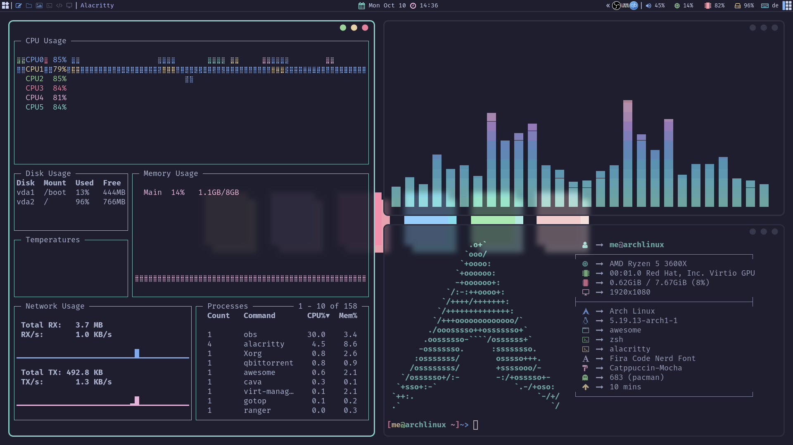
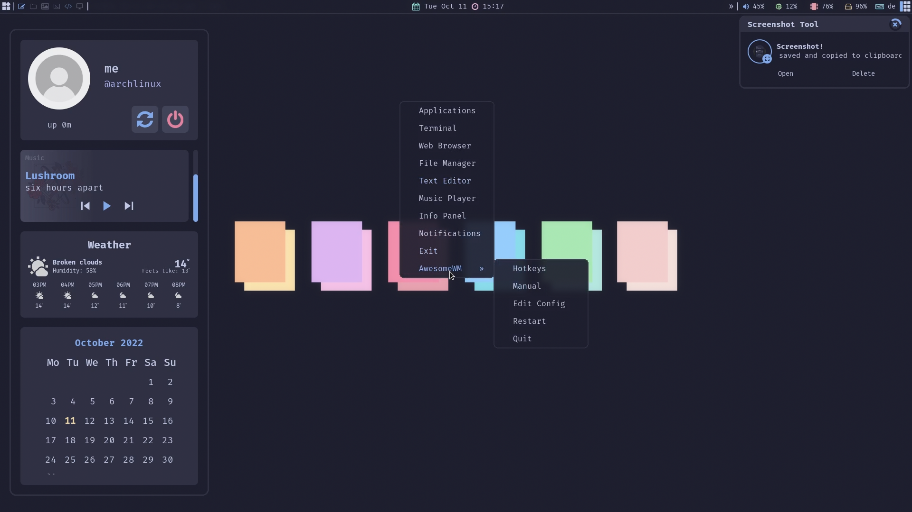
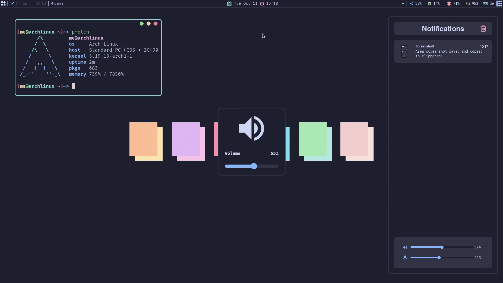

# Awespuccin

<!-- rice preview -->

<div align="center">
   <a href="#--------">
      
   </a>
</div>

<br>

<!-- badges -->
<h1>
  <a href="#--------">
    
  </a>
</h1>

<br>

## Welcome to .files! :heart_on_fire:

<a href="https://awesomewm.org/"></a>

<b> Awespuccin - a AwesomeWM Catppuccin config </b>

Welcome to my AwesomeWM configuration files!

This is my personal repository, everything is themed with the Catppuccin Mocha Colorscheme.

Feel free to steal anything from here but don't forget to give me **credits** :)

AwesomeWM is the most powerful and highly configurable next-generation framework window manager for X.
Although it takes time and effort to configure it, I am satisfied with the result.

<!-- information -->

## :snowflake: <samp>Information</samp>



Here are some details about my setup:

- **OS:** [Arch Linux](https://archlinux.org)
- **WM:** [awesome](https://github.com/awesomeWM/awesome)
- **Terminal:** [alacritty](https://alacritty.org/)
- **Shell:** [zsh](https://www.zsh.org/)
- **Editor:** [vscodium](https://github.com/VSCodium/vscodium)
- **Compositor:** [picom](https://github.com/yshui/picom)
- **Application Launcher:** [rofi](https://github.com/davatorium/rofi)
- **Music Player** [ncmpcpp](https://github.com/ncmpcpp/ncmpcpp)

AwesomeWM Modules:

- **[bling](https://github.com/blingcorp/bling)**
  - Adds new layouts, modules, and widgets that try to focus on window management primarily
- **[layout-machi](https://github.com/xinhaoyuan/layout-machi)**
  - Manual layout for Awesome with an interactive editor
- **[rubato](https://github.com/andOrlando/rubato)**
  - Animation library for AwesomeWM

Main Features:



- **Catppuccin Mocha Colorscheme**
- **Cool Window decorations**
- **Info Panel**
- **Notification Panel**
- **Top Panel**
- **Minimalist Exit Screen**
- **App Launcher**
- **Volume OSD**
- **LayoutList PopUP**
- **Many cool Widgets**
- **Animated Systray**
- **Beautiful Naughty Notifications**
- **Right-Click Main Menu**
- **Playerctl Support**
- **Scratchpad**

<br>

<!-- Setup -->

## :wrench: <samp>Setup</samp>

<details>
<summary><b>1. Install the Dependencies</b></summary>
<br>
:warning: **This setup instructions only provided for Arch Linux (and other Arch-based distributions)**

Assuming your _AUR Helper_ is [yay](https://github.com/Jguer/yay).

> First of all you should install the [git version of AwesomeWM](https://github.com/awesomeWM/awesome/).
```sh
yay -S awesome-git
```

> Install necessary dependencies
```sh
yay -Syu picom-git alacritty mpc playerctl ncmpcpp mpd xdg-utils \
pipewire pipewire-pulse pipewire-alsa alsa-utils feh rofi maim \
xclip jq pamixer colord mpDris2 imagemagick inotify-tools --needed
```

> Enable Services
```sh
systemctl --user enable mpd.service
systemctl --user start mpd.service
systemctl --user enable mpDris2.service
systemctl --user start mpDris2.service
```

> Optional Programms
```sh
yay -Syu thunar ranger vim zsh firefox pavucontrol gotop vscodium
```

> Font/Theming
```sh
yay -S nerd-fonts-fira-code catppuccin-gtk-theme-mocha tela-circle-icon-theme-git
```
</details>

<details>
<summary><b>2. Install Dotfiles</b></summary>
<br>

> Clone this repository
```sh
git clone --depth 1 --recurse-submodules https://github.com/V2BlockBuster2K/Awespuccin.git
cd Awespuccin && git submodule update --remote --merge
```

> Copy config/desktop files
```sh
cp -r conf/* ~/.config/
cp -r desktop/.* ~/
```

> Install FiraCode Nerd Font if you haven't already done so
```sh
cp -r misc/* ~/.fonts/
# or to ~/.local/share/fonts
cp -r misc/fonts/* ~/.local/share/fonts/
```

> And run this command for your system to detect the newly installed font

```sh
fc-cache -fv
```
</details>

<details>
<summary><b>3. Edit Configs</b></summary>
<br>

> Edit ~/.config/awesome/user_variables.lua
> enter your Weater API Key from [Openweathermap](https://openweathermap.org/) here 
```sh       
key = " ",
```
> Add coordinates which you can find if you search your city name on [Openweathermap](https://openweathermap.org/) here
```sh       
coordinates = {
" ", --- lat
" ", --- lon
```
> Add your microphone name which you can get throuh **_pamixer --list-sources | grep input_** here
```sh       
mic = {
   -- For example "alsa_input.pci-0000_00_1b.0.analog-stereo"
   name = "",
```
> Add disk name which you can find throuh **_lsblk_** here
```sh       
disk = {
   -- For example "/dev/sda2"
   name = "",
```
> Last but not least, you can change your profile picture in ~/.config/awesome/themes/catppuccin/theme.lua line 73 "theme.pfp" to your image name
```sh
theme.pfp = themes_path.."catppuccin/assets/yournamehere.png"
-- default path is "catppuccin/assets/pfp.jpg"
```
> And you are done, you can now try out your new Desktop! :tada:

Log out from your current desktop session and just startx!

</details>


<!-- Colorscheme -->

## :art: <samp>Colorscheme</samp>

<a href="#--------"></a>

The colorscheme is [Catppuccin Mocha](https://github.com/catppuccin/catppuccin) which is a colorful good looking pastel colorscheme, there are way more configs available for many different programms on there repo (cava, vim, discord...), so go check them out!

<!-- License -->

## :scroll: <samp>License</samp>

Awespuccin is under <a href="https://github.com/V2BlockBuster2K/Awespuccin/blob/main/LICENSE">GNU GPL-3.0 License.
</a>

<!-- Author -->

## :bust_in_silhouette: <samp>Author</samp>

Awespuccin is created by <a href="https://github.com/V2BlockBuster2K">V2BlockBuster2K</a>.

<!-- Todo -->
  
## :white_check_mark: <samp>Todo</samp>
- [ ] Rework buttons (animations) (Playerctl) -> Hover effects on panels
- [ ] Add decoration for ncmpcpp
- [ ] Github widget (notfication-panel)
- [ ] Clickable calendar (info-panel)
- [ ] Rework main-menu

<!-- Credits -->
   
## :heart: <samp>Credits</samp>

- **[Rxyhn](https://github.com/rxyhn/dotfiles)**
- **[Kasper24](https://github.com/Kasper24)**
- **[rklyz](https://github.com/rklyz)**
- **[unixsea](https://github.com/unixsea)**


<br>

**<samp>And everyone on the [r/awesomewm subreddit](https://reddit.com/r/awesomewm) and [AwesomeWM Discord](https://discord.com/invite/BPat4F87dg) who helped me with this Rice!<samp/>** :fire:
