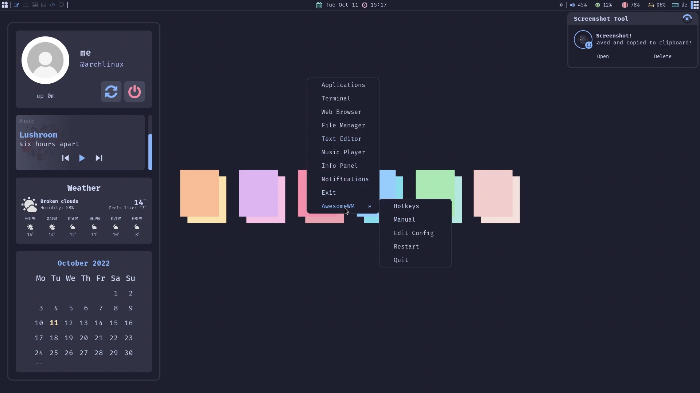

# Awespuccin
My Catppuccin themed AwesomeWM Config - Awespuccin

<!-- rice preview -->

<div align="center">
   <a href="#--------">
      
   </a>
</div>

<br>

<!-- information -->

## :snowflake: <samp>Information</samp>



Here are some details about my setup:

- **OS:** [Arch Linux](https://archlinux.org)
- **WM:** [awesome](https://github.com/awesomeWM/awesome)
- **Terminal:** [alacritty](https://alacritty.org/)
- **Shell:** [zsh](https://www.zsh.org/)
- **Editor:** [vscodium](https://github.com/VSCodium/vscodium)
- **Compositor:** [picom](https://github.com/yshui/picom)
- **Application Launcher:** [rofi](https://github.com/davatorium/rofi)
- **Music Player** [ncmpcpp](https://github.com/ncmpcpp/ncmpcpp)

AwesomeWM Modules:

- **[bling](https://github.com/blingcorp/bling)**
  - Adds new layouts, modules, and widgets that try to focus on window management primarily
- **[layout-machi](https://github.com/xinhaoyuan/layout-machi)**
  - Manual layout for Awesome with an interactive editor
- **[rubato](https://github.com/andOrlando/rubato)**
  - Animation library for AwesomeWM

Main Features:


- **Catppuccin Mocha Colorscheme**
- **Cool Window decorations**
- **Info Panel**
- **Notification Panel**
- **Top Panel**
- **Minimalist Exit Screen**
- **App Launcher**
- **Volume OSD**
- **LayoutList PopUP**
- **Many cool Widgets**
- **Animated Systray**
- **Beautiful Naughty Notifications**
- **Right-Click Main Menu**
- **Playerctl Support**
- **Scratchpad**

<br>

<!-- Setup -->

## :wrench: <samp>Setup</samp>

<details close>
<summary><b>1. Install the Dependencies</b></summary>
<br>
:warning: **This setup instructions only provided for Arch Linux (and other Arch-based distributions)**

Assuming your _AUR Helper_ is [yay](https://github.com/Jguer/yay).

> First of all you should install the [git version of AwesomeWM](https://github.com/awesomeWM/awesome/).
```sh
yay -S awesome-git
```

> Install necessary dependencies
```sh
yay -Syu picom-git alacritty mpc playerctl ncmpcpp mpd xdg-utils \
pipewire pipewire-pulse pipewire-alsa alsa-utils feh rofi maim \
xclip jq pamixer colord mpDris2 imagemagick inotify-tools --needed
```

> Enable Services
```sh
systemctl --user enable mpd.service
systemctl --user start mpd.service
systemctl --user enable mpDris2.service
systemctl --user start mpDris2.service
```

> Optional
```sh
yay -Syu thunar ranger vim zsh firefox pavucontrol gotop
```

> Font/Theming
```sh
yay -S nerd-fonts-fira-code catppuccin-gtk-theme-mocha tela-circle-icon-theme-git
```
</details>

<details>
<summary><b>2. Install Dotfiles</b></summary>
<br>

> Clone this repository
```sh
git clone --depth 1 --recurse-submodules https://github.com/V2BlockBuster2K/Awesppuccin.git
cd Awesppuccin && git submodule update --remote --merge
```

> Copy config/desktop files
```sh
cp -r conf/* ~/.config/
cp -r desktop/.* ~/
```

> Install FiraCode Nerd Font if you haven't already done so
```sh
cp -r misc/* ~/.fonts/
# or to ~/.local/share/fonts
cp -r misc/fonts/* ~/.local/share/fonts/
```

> And run this command for your system to detect the newly installed fonts.

```sh
fc-cache -fv
```
> Congratulations, you can now try out your new Desktop! :tada:

Log out from your current desktop session and log in!

</details>

<!-- License -->

## :scroll: <samp>License</samp>

Awespuccin is under <a href="https://github.com/V2BlockBuster2K/Awespuccin/blob/main/LICENSE">GNU GPL-3.0 License.
</a>

<!-- Author -->

## :bust_in_silhouette: <samp>Author</samp>

Awespuccin is created by <a href="https://github.com/V2BlockBuster2K">V2BlockBuster2K</a>.

<!-- Todo -->
  
## :white_check_mark: <samp>Todo</samp>
- [ ] Rework Buttons (Animations) (Playerctl) -> Hover Effects on Panels
- [ ] Add decoration for ncmpcpp
- [ ] Github widget (notfication-panel)
- [ ] Clickable calendar (info-panel)
- [ ] Rework main-menu

<!-- Credits -->
   
## :heart: <samp>Credits</samp>

- **[Rxyhn](https://github.com/rxyhn/dotfiles)**
- **[Kasper24](https://github.com/Kasper24)**
- **[rklyz](https://github.com/rklyz)**
- **[unixsea](https://github.com/unixsea)**


<br>

**<samp>And everyone on the [r/awesomewm subreddit](https://reddit.com/r/awesomewm) and [AwesomeWM Discord](https://discord.com/invite/BPat4F87dg) who helped me with this Rice!<samp/>** :fire:
